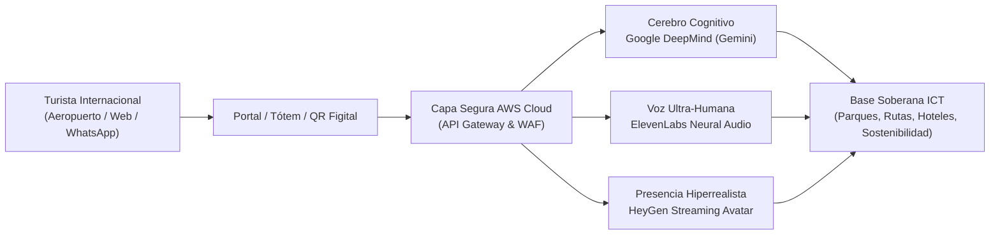

# ICT - Instituto Costarricense de Turismo & Nexus Holding Group
## Documento de Arquitectura Técnica y Viabilidad Soberana / Documento de Arquitetura Técnica e Viabilidade Soberana
**Proyecto / Projeto:** Elena — Embajadora Digital del Turismo de Costa Rica  
**Destinatarios / Destinatários:** Don Alberto López (Gerente General), Alexander Díaz (TI & Tecnologías de Información) y Equipo Técnico del ICT  
**Autor / Emitido por:** Geanderson Leandro Schuh — Founder & CEO, Nexus Holding Group  
**Fecha / Data:** 24 de Septiembre de 2026 / 24 de Setembro de 2026  
**Clasificación / Classificação:** Confidencial / Propuesta Técnica de Homologación  

---

# PARTE 1: VERSIÓN EN ESPAÑOL (Para el ICT)

## 1. Resumen Ejecutivo
El **Instituto Costarricense de Turismo (ICT)** lidera la promoción y acogida turística de uno de los destinos más sostenibles y admirados del mundo. Para atender al visitante internacional con excelencia sin precedentes, **Nexus Holding Group** presenta la arquitectura técnica de **Elena**: la Embajadora Digital Hiperrealista con Inteligencia Artificial Soberana.

Elena combina presencia humana fotorrealista, procesamiento cognitivo avanzado en más de 50 idiomas y despliegue multicanal (Tótems en Aeropuertos/Centros de Información, Portal Web Oficial y WhatsApp), con una infraestructura blindada que garantiza soberanía absoluta de datos y cero latencia.



---

## 2. Los 4 Pilares Tecnológicos de Clase Mundial

Para garantizar que Elena no sea un simple "chatbot", sino un activo de estado de altísima fidelidad, el ecosistema se fundamenta en 4 motores tecnológicos líderes:

### Pilar 1: Cerebro Cognitivo & Razonamiento Turístico (Google DeepMind)
* **Motor:** Modelos avanzados de última generación de Google DeepMind (Gemini 1.5 Pro / Flash y arquitecturas 3.0+).
* **Función:** Comprensión profunda de la intención del turista, razonamiento contextual multilingüe, conocimiento de la geografía, biodiversidad, parques nacionales, gastronomía y cultura de Costa Rica.
* **Alineación Oficial:** El cerebro de Elena se alimenta exclusivamente de fuentes autorizadas por el ICT, eliminando cualquier riesgo de alucinación informativa.

### Pilar 2: Síntesis de Voz Humana & Acento Cálido (ElevenLabs)
* **Motor:** Red neuronal de audio de alta fidelidad ElevenLabs.
* **Función:** Generación de voz con inflexión humana cálida, modulación emocional natural y pronunciación nativa en más de 50 idiomas (Español, Inglés, Francés, Alemán, Mandarín, etc.).
* **Identidad Tica:** La voz en español está calibrada con la cadencia y hospitalidad característica de Costa Rica ("Pura Vida").

### Pilar 3: Presencia e Interacción Hiperrealista (HeyGen Interactive Streaming)
* **Motor:** Avatar fotorrealista en tiempo real HeyGen Enterprise.
* **Función:** Sincronización labial milimétrica (*lip-sync*), microexpresiones faciales y presencia visual empática.
* **Rendimiento:** Optimizado con WebRTC para streaming de video continuo con latencia inferior a 800 milisegundos en quioscos interactivos y web.

### Pilar 4: Seguridad, Cero Fugas & Despliegue en la Nube (AWS Sovereign Security)
* **Infraestructura:** Amazon Web Services (AWS) con cifrado de grado militar.
* **Seguridad:** Cifrado de datos en tránsito (TLS 1.3) y en reposo (AES-256).
* **Control de Red:** Protección DDoS mediante AWS Shield, WAF (Web Application Firewall) para filtrado de tráfico malicioso y VPC (Virtual Private Cloud) aislada.
* **Soberanía del Dato:** Ningún dato sensible o historial de consultas es utilizado para entrenar modelos públicos externos.

---

## 3. Arquitectura Multicanal & Experiencia "Figital"

```
[ Aeropuertos y Centros ICT ]          [ Móvil del Turista ]              [ Nube Soberana ]
         │                                      │                                 │
   Tótem Digital 4K                             │                                 │
   Elena Video Interactiva ──────────> Genera QR Dinámico                          │
                                                │                                 │
                                      Transfiere contexto                         │
                                      a WhatsApp ICT ───────────────────> Elena Asistente 24/7
```

1. **Tótems Físicos Interactivos:**
   * Ubicación estratégica: Aeropuerto Internacional Juan Santamaría (SJO), Aeropuerto de Guanacaste (LIR) y Oficinas Regionales del ICT.
   * Pantallas táctiles con micrófono y cámara de presencia.
2. **Handoff "Figital" (Físico a Digital vía QR Dinámico):**
   * Cuando el turista interactúa en el tótem del aeropuerto, Elena genera un **código QR dinámico**.
   * Al escanearlo con su teléfono móvil, la conversación continúa exactamente donde se quedó dentro de su **WhatsApp personal**, acompañándolo durante todo su viaje por el país.
3. **Portal Web Oficial del ICT (`ict.go.cr` / `visitcostarica.com`):**
   * Widget responsivo flotante de alta velocidad para resolver dudas y generar itinerarios de viaje en segundos.

---

## 4. Privacidad, Seguridad y Cumplimiento Normativo

La seguridad de la información es el eje central de nuestra ingeniería:

| Parámetro | Especificación de Seguridad Nexus |
| :--- | :--- |
| **Protección de Datos** | Conformidad estricta con la **Ley de Protección de la Persona frente al Tratamiento de sus Datos Personales (Ley N° 8968 de Costa Rica)** y el estándar internacional **GDPR / RGPD**. |
| **Almacenamiento** | Alojamiento en clústeres seguros de AWS con opción de residencia de datos dentro de las directrices del Gobierno de Costa Rica. |
| **Anonimización** | No se recopilan datos personales identificables (PII) sin consentimiento explícito. Las interacciones se procesan mediante identificadores criptográficos efímeros. |
| **Gobernanza de Respuestas** | *Guardrails* (barreras éticas) que impiden que el modelo responda temas ajenos al turismo, cultura, seguridad ciudadana y servicios del país. |

---

## 5. Próximos Pasos para la Homologación Técnica

1. **Revisión Preliminar de TI:** Validación de este documento por parte de Alexander Díaz y el equipo de tecnologías del ICT.
2. **Sesión Técnica de Demostración (25 minutos):** Presentación en vivo del motor de inferencia, el panel de control administrativo y la integración con las APIs del ICT.
3. **Piloto Controlado:** Definición de un entorno de pruebas (*sandbox*) para evaluación de rendimiento y latencia.

---
---

# PARTE 2: VERSÃO EM PORTUGUÊS (Para Alinhamento Interno Nexus)

## 1. Resumo Executivo
O **Instituto Costarricense de Turismo (ICT)** é a autarquia ministerial que comanda o turismo da Costa Rica. O projeto **Elena** posiciona o país na vanguarda mundial ao introduzir a primeira Embaixadora Digital de Turismo Hiper-realista com Inteligência Artificial Soberana.

A Elena unifica atendimento presencial e digital com empatia humana, suporte a mais de 50 idiomas e arquitetura de altíssima segurança para os canais: Totens de Aeroportos/Centros de Recepção, Portal Oficial e WhatsApp.

---

## 2. Os 4 Pilares Tecnológicos Inegociáveis

1. **Pilar 1 — Cérebro Cognitivo (Google DeepMind):**
   * Modelos Gemini de última geração para raciocínio turístico profundo, sem alucinações, baseado exclusivamente na base de dados oficial e verificada do ICT.
2. **Pilar 2 — Voz Humana & Inflexão Emocional (ElevenLabs):**
   * Síntese neural de voz com cadência acolhedora e sotaque característico da Costa Rica ("Pura Vida"), adaptável nativamente a mais de 50 idiomas.
3. **Pilar 3 — Presença Visual Hiper-realista (HeyGen Streaming):**
   * Avatar interativo em vídeo com sincronia labial em tempo real e latência inferior a 800ms via WebRTC.
4. **Pilar 4 — Segurança Soberana & Nuvem Blindada (AWS):**
   * Infraestrutura em nuvem privada AWS, criptografia TLS 1.3 e AES-256, proteção contra ataques (WAF / DDoS) e estrita conformidade com a Lei de Proteção de Dados da Costa Rica (Lei 8968) e RGPD.

---

## 3. O Diferencial "Figital" (Do Balcão ao WhatsApp)
* O turista conversa com o totem no aeroporto.
* Ao final, a Elena emite um **QR Code dinâmico**.
* O turista escaneia com o celular e todo o itinerário e histórico continuam direto no **WhatsApp** dele, transformando o ICT em um guia 24/7 de bolso em todo o território nacional.

---

## 4. Postura Executiva Nexus
Este documento comprova solidez técnica, clareza arquitetural e respeito às normas de TI do setor público, pavimentando a aprovação técnica para a contratação definitiva.
